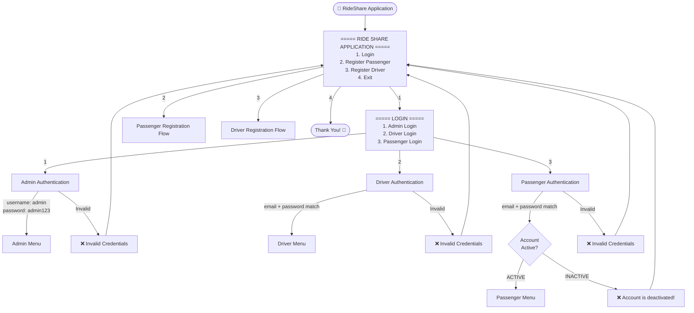
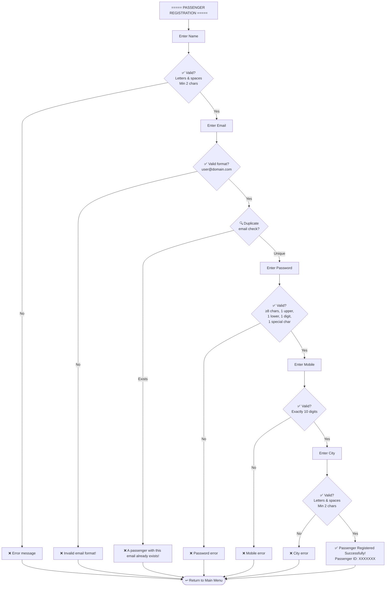
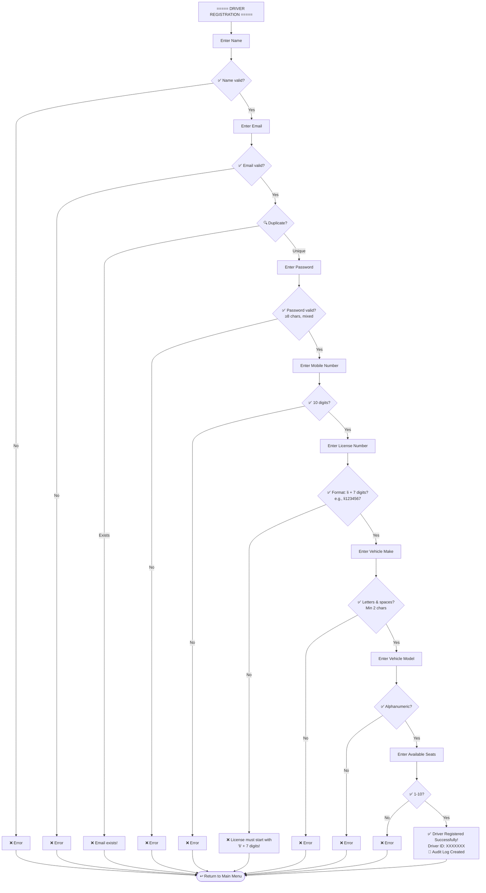
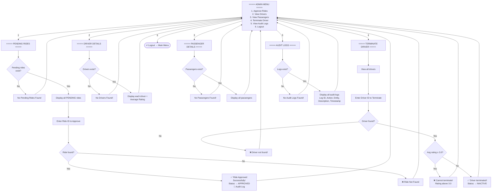
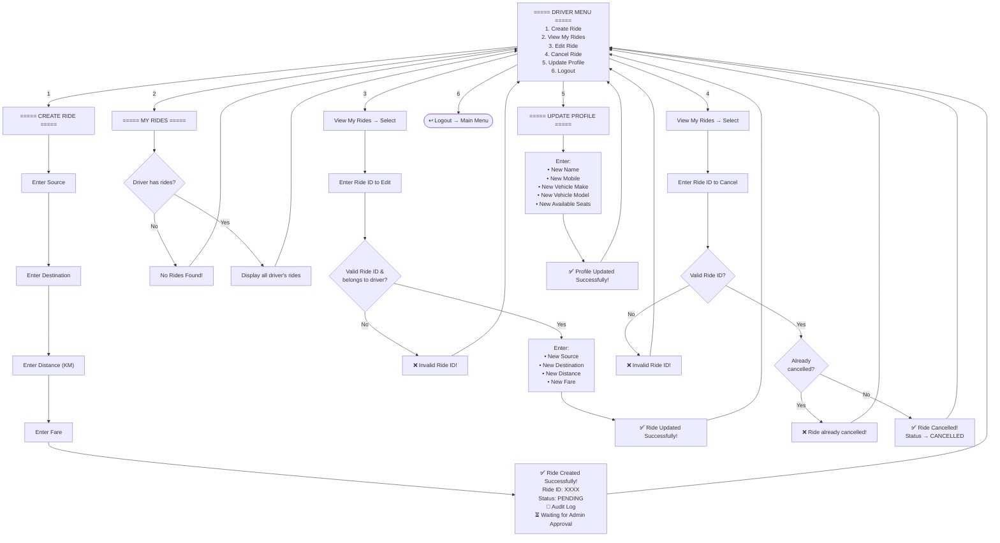
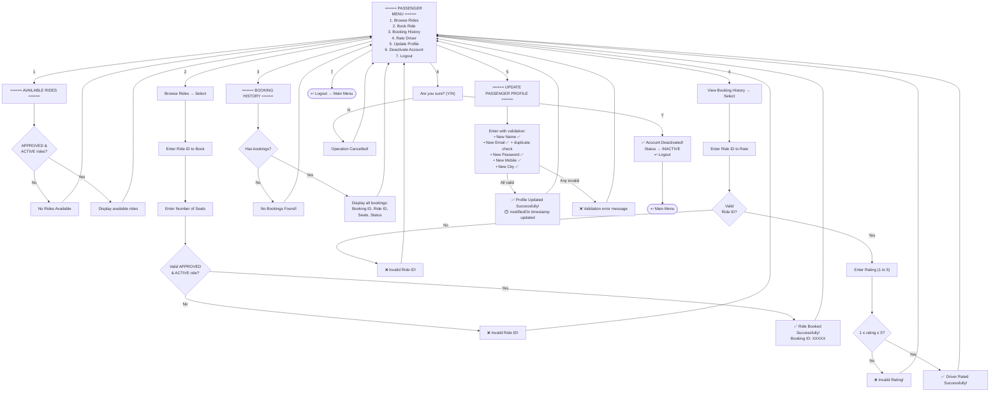
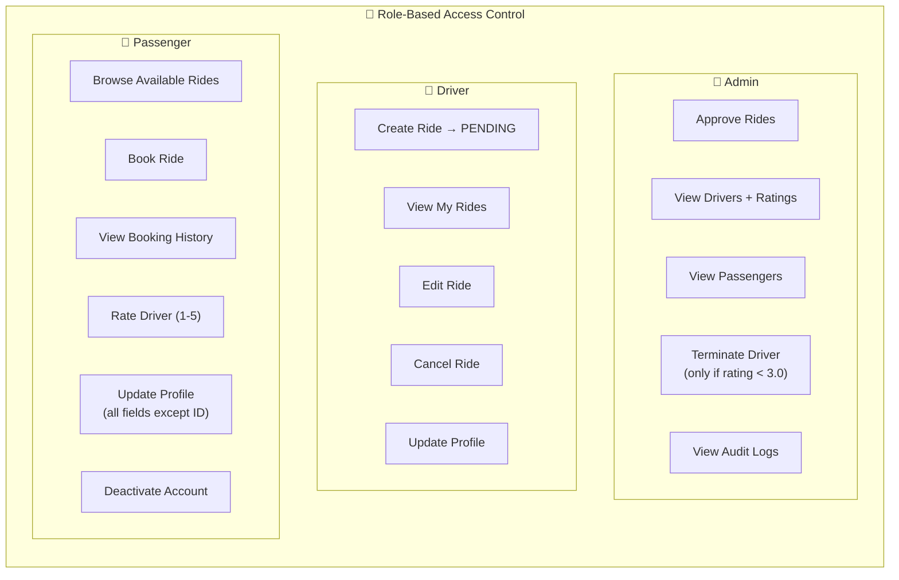
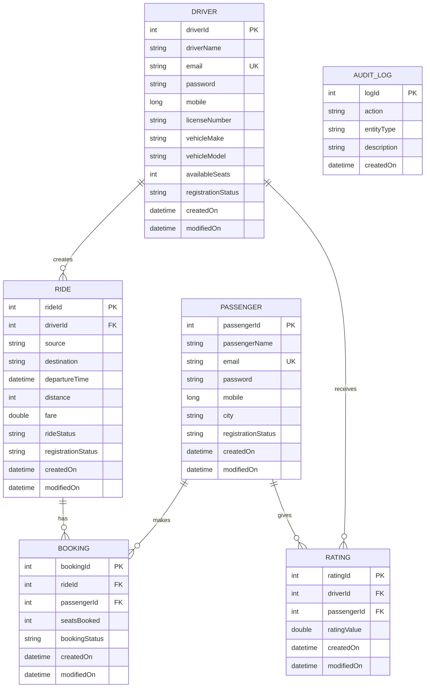

# RideShare — Complete UI Flow Diagram

## 1. Application Entry Point & Main Navigation

---

## 2. Passenger Registration Flow

---

## 3. Driver Registration Flow

---

## 4. Admin Menu — Full Operations

---

## 5. Driver Menu — Full Operations

---

## 6. Passenger Menu — Full Operations

---

## 7. Complete Role-Based Access Summary

---

## 8. Data Model Relationships

---

## 9. Validation Rules Summary

| Field | Rules |
|---|---|
| **Name** | Letters & spaces only, min 2 chars |
| **Email** | Valid format `user@domain.com`, must be unique per role |
| **Password** | Min 8 chars, 1 uppercase, 1 lowercase, 1 digit, 1 special char |
| **Mobile** | Exactly 10 digits |
| **City** | Letters & spaces only, min 2 chars |
| **License Number** | Prefix `li` + exactly 7 digits (e.g., `li1234567`) |
| **Vehicle Make** | Letters & spaces only, min 2 chars |
| **Vehicle Model** | Letters, digits & spaces only |
| **Available Seats** | Integer between 1 and 10 |
| **Rating** | Double between 1.0 and 5.0 |
